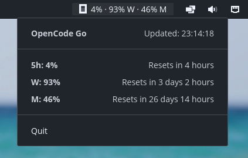

# cosmic-applet-opencode-quota

A native **COSMIC panel applet** that shows your OpenCode Go quota usage right in
the panel: `16% · 38% W · 22% M` (5h · week · month, consumed share). Clicking it
opens details with relative reset times. Icon and text automatically follow the
dark/light theme.



## Install (user-local)

Download the release tarball (GitHub Releases) and:

```bash
tar -xzf cosmic-applet-opencode-quota-linux-x86_64.tar.gz
./install.sh
```

Then add the *OpenCode Quota* applet to a panel wing in
**Settings → Panel → Applets**.

**API key:** Expects the `opencode-go` entry in
`~/.local/share/opencode/auth.json` (`{ "type": "api", "key": … }`) or the
`OPENCODE_API_KEY` environment variable.

## Build (from source)

Requires Rust plus system packages (`libwayland-dev`, `libxkbcommon-dev`, …).

```bash
cargo build --release
# Binary: target/release/cosmic-applet-opencode-quota
# Manual install:
install -Dm0755 target/release/cosmic-applet-opencode-quota ~/.local/bin/
sed "s|@BIN@|$HOME/.local/bin/cosmic-applet-opencode-quota|" \
  data/net.d11n.CosmicOpencodeQuota.desktop \
  > ~/.local/share/applications/net.d11n.CosmicOpencodeQuota.desktop
install -Dm0644 o.svg ~/.local/share/icons/hicolor/scalable/apps/net.d11n.CosmicOpencodeQuota.svg
```

## Data source

`GET https://opencode.ai/zen/go/v1/usage` — Bearer auth with the OpenCode Go key.
The response provides `usage.{rolling,weekly,monthly}` with `percent` (consumed
share) and `resetsAt`. No OpenCode Zen balance is available (no official
balance API).

## Details

- Refresh every 60s; startup immediately shows the last cached values
  (`~/.cache/opencode-quota/cache.json`).
- Errors (missing key, network/auth) are explained in the popup.
- As a libcosmic applet it does not use StatusNotifierItem, so readable
  wide text at full panel height is possible.

## Localization

English is the source locale; German is included and selected automatically
from your desktop locale. Set `I18N_LANGUAGE` (e.g. `en` or `de`) to override.
